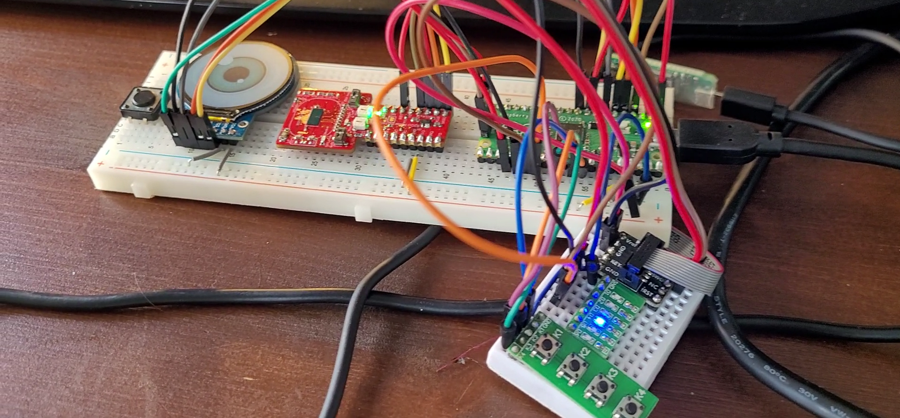

# MIC5 Assignment - Embedded RTOS
This repository is created for the Microcontrollers 5 course in semester 6 (3rd year) of my Embedded Systems Engineering Bachelor program. It contains a modified codebase that is part of the semester 6 (projectname: HealthBot) project on Social Robotics I also work on (For HAN Health Concept Lab). This separate repository focuses on demonstrating FreeRTOS primary highlights and concepts for the course assessment.

## Background
The course focused on Embedded RTOS concepts and applications. For the final assessment, students were required to implement their own Embedded RTOS-based system (using FreeRTOS, Zephyr, TI-RTOS, VxWorks, etc.). I chose FreeRTOS and the Raspberry Pi Pico, which I also used in my semester 6 project. This codebase is a FreeRTOS-specialized version of the semester 6 firmware development project. It includes specific application logic to better illustrate FreeRTOS features.

The program, while not performing any real-world useful functions, serves as a demonstrative implementation of FreeRTOS with developed drivers. Ultimately, this codebase is used in the creation of a social robot aimed at entertaining the elderly.

## Result
The presented repository is graded with a 8.6 by the course teacher (Ewout Boks). The assessment was based on the following things:

1. Description of scheduling techniques
2. Description of inter-task communication
3. Source code Quality (structural)
4. Documented RTOS Configuration
5. High Level Design (Architecture)
6. Test Scenarios

For each sections between 0 and 3 points could be obtained, and the grade is given by: 
Grade = \(\frac{\sum \text{Scores per assessment criterion}}{3 \times \text{Number of criteria}} \times 10\)

## System Overview
This project builds upon previous display firmware, adding motor control on the Raspberry Pi Pico W microcontroller. The system integrates various drivers and utilizes FreeRTOS to manage concurrent tasks effectively.

The diagram illustrates the embedded system's architecture centered around a microcontroller unit (MCU). Key components include:
- **MCU (Microcontroller Unit)**: Manages all peripherals and interfaces.
- **mmWave RADAR**: Connected via SPI for device control.
- **SW Array (Switch Array)**: Inputs data to the MCU, for event groups demonstration.
- **Serial Port**: Facilitates UART communication for debugging and data exchange.
- **Speaker**: Outputs audio via PDM (Pulsed Audio).
- **Step Motor**: Step Motor controlled via step, direction, and enable signals for precise movement.
- **LEDs**: Indicate status of the event group's bits set by the buttons.
- **Display**: Managed over SPI for user interface display.
- **DB Port (Debug Port)**: Used for system diagnostics and programming.

This setup demonstrates the MCU's role as a central hub, coordinating input/output devices and managing data flow in a potentially real-time operating system environment.

## Features
- ***Stepper Motor Driver***: Implementation for controlling a stepper motor.
- ***UART Asynchronous Communication***: Driver for UART communication without blocking the main execution flow.
- ***PWM Audio Output***: Controller for audio output using Pulse Width Modulation.
- ***Dual-Core Functionality***: Utilization of both cores on the Pico W for improved performance and task distribution.
- ***Display Control***: Management of display tasks using the LVGL library.
FreeRTOS Concepts
- ***Software Timers***: Timer services for delayed and periodic execution of functions.
- ***Task Wake-Up from ISR***: Use of xHigherPriorityTaskWoken to manage task wake-ups from interrupt service routines.
- ***Deferred Interrupt Handling***: Deferring work to the RTOS daemon task for processing outside of interrupt context.
- ***Semaphores and Mutexes***: Synchronization primitives for managing resource access and task coordination.
- ***Event Groups***: Mechanism for task synchronization based on events.

## Testing Methodology
- **Logic Analyzer**: System signals were tested using a logic analyzer to verify timing and signal integrity.
- **TTL Module**: External UART communication was tested using a TTL module to ensure reliable data transmission.
- **JLink Edu Mini Debugger**: Various system scenarios were verified using the JLink Edu Mini debugger and serial prints for real-time debugging and validation.

## Other Documentation
For more details, like the test description, performance analysis and other technical specifics check the [MIC5-REPORT](docs/v1.0-MIC5%20-%20Healthbot%20FW.pdf) 
